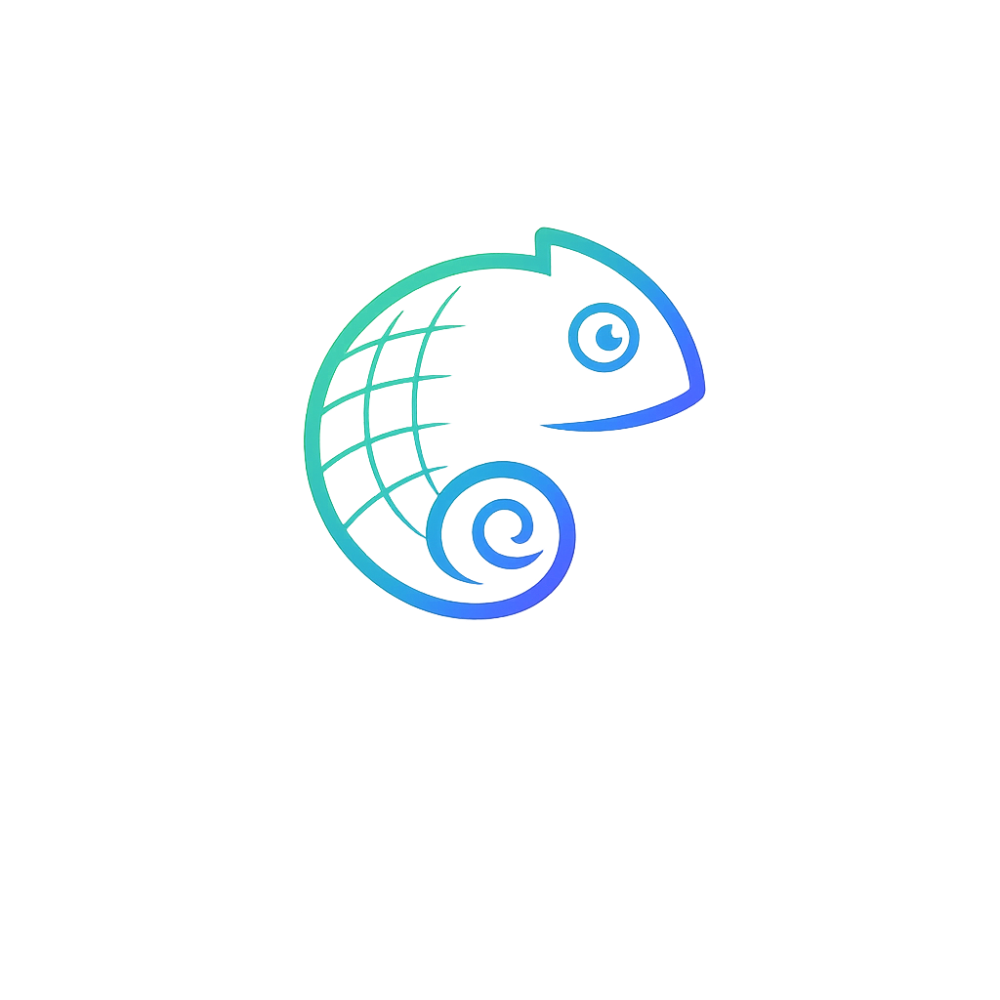
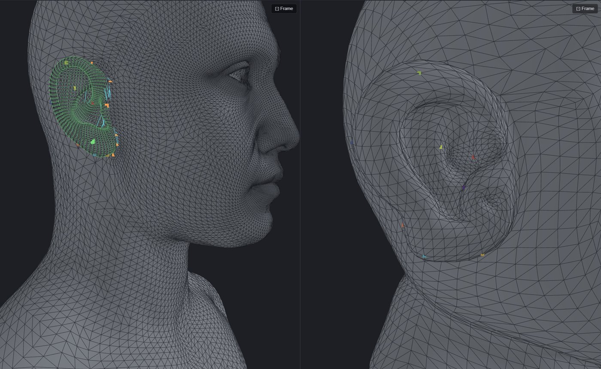
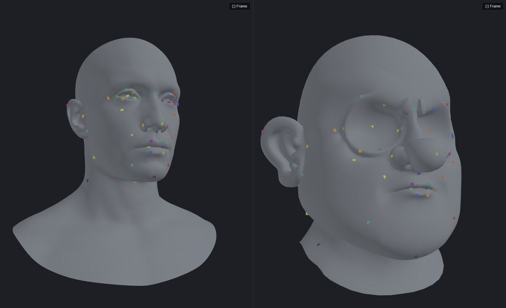
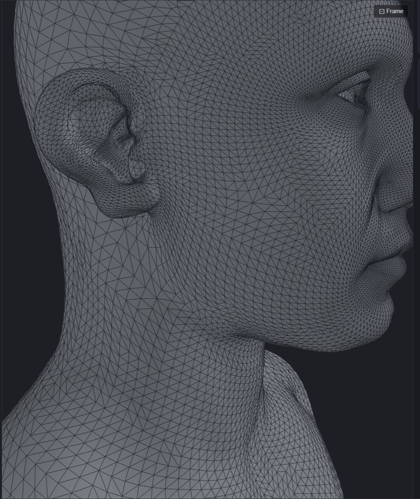
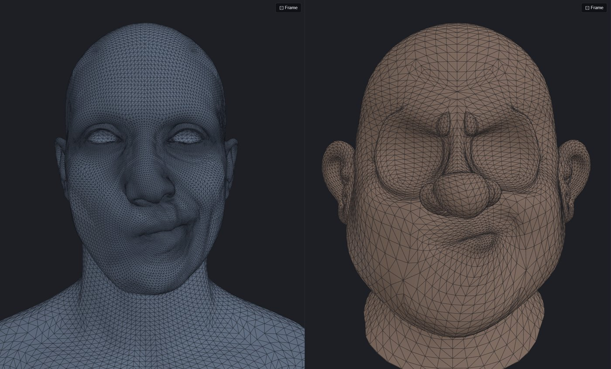

<p align="center">
  
</p>

<h1 align="center">Chameleon Warp</h1>

<p align="center">
  Wrap one 3D mesh onto another, transfer blendshapes between characters and fit
  garments onto a body — in your browser, running on your own machine.
</p>

<p align="center">
  <a href="#quick-start">Quick start</a> ·
  <a href="docs/TOOLS.md">Tools guide</a> ·
  <a href="docs/INSTALL.md">Installation</a> ·
  <a href="docs/CONFIGURATION.md">Configuration</a> ·
  <a href="docs/API.md">API</a> ·
  <a href="docs/DEVELOPMENT.md">Development</a>
</p>

---

Chameleon Warp is a local web app for character and asset work. You load a
**source** and a **target** mesh, click a handful of matching landmarks, and
press one button. Everything runs on your computer: the browser UI talks to a
local Python backend, and your meshes never leave the machine.

It is built on the Sumner–Popović *Deformation Transfer for Triangle Meshes*
method (via [mickare/Deformation-Transfer-for-Triangle-Meshes](https://github.com/mickare/Deformation-Transfer-for-Triangle-Meshes)),
extended with a surface-aware wrap solver, region editing and a body-aware
garment refit.

| Wrap Region — borrow a detailed ear | DT Transfer — same expression, another character |
|---|---|
|  |  |
|  |  |

## Tools

| Tool | What it does | Typical use |
|---|---|---|
| **Wrap** | Conforms the source onto the target's shape, keeping the source's topology, vertex order and UVs. | Wrap a clean basemesh onto a scan (retopology), make a character variant that still fits your rig. |
| **Wrap Region** | Wraps only a patch you outline; everything outside stays exactly in place, with a feathered seam. | Replace an ear, reshape a nose, without touching the rest of the head. |
| **DT Transfer** | Transfers poses / blendshapes of the source onto the target (deformation transfer). | Give a second character the same facial expressions. Exports OBJ, ZIP or an FBX with shape keys. |
| **Refit** *(beta)* | Body-aware garment fit: contact field, layer detection, shape-preserving bind, collision handling. | Dress a character in cloth, armor or seam-attached accessories. |
| **Fit** *(beta)* | Pins an accessory's marker points onto the target and deforms the rest minimally. | Glasses on a face, a badge, horns. |

Every tool is a step-by-step wizard with an in-app guide. The full walkthrough
is in **[docs/TOOLS.md](docs/TOOLS.md)**.

Highlights:

- Interactive marker picking with symmetric mode, undo/redo and JSON import/export.
- **No markers needed** when source and target share topology (wrap → blendshape retarget workflow).
- Quads and UVs survive: results are written back in the original polygon layout.
- Residual heatmap and mean/p95/max distance to the target after every wrap.
- **FBX** in and out (with Blender installed): shape keys are extracted as poses on upload, and DT results download as one FBX with shape keys.
- Long jobs run in the background with progress — close the tab and come back.
- Results are cached per session: re-running with tweaked settings or extra poses only recomputes what changed.

## Quick start

### Docker (recommended)

Requires [Docker](https://docs.docker.com/get-docker/) with Compose.

```bash
git clone https://github.com/iss2g/chameleon-warp.git
cd chameleon-warp
docker compose up -d --build
```

Open **<http://localhost:8000>**. The image bundles Blender for FBX support; the
first build takes a few minutes. Stop with `docker compose down` — your sessions
are kept in a Docker volume.

### Native (Linux / macOS / Windows)

Requires **Python 3.9** (or [uv](https://docs.astral.sh/uv/), which fetches it
for you) and **Node.js 18+**. [Blender 4.x](https://www.blender.org/download/)
is optional and only needed for FBX.

```bash
git clone https://github.com/iss2g/chameleon-warp.git
cd chameleon-warp
./scripts/setup.sh     # once: Python venv, dependencies, UI build
./scripts/start.sh     # http://127.0.0.1:8000
```

Windows (PowerShell):

```powershell
git clone https://github.com/iss2g/chameleon-warp.git
cd chameleon-warp
powershell -ExecutionPolicy Bypass -File scripts\setup.ps1
powershell -ExecutionPolicy Bypass -File scripts\start.ps1 -Open
```

More options — updating, Apple Silicon, LAN access, Blender, troubleshooting —
are in **[docs/INSTALL.md](docs/INSTALL.md)**.

### Try it with the bundled meshes

[`demo_assets/`](demo_assets/) has redistributable sample meshes: an ICT-FaceKit
neutral head with five blendshapes (DT Transfer source + poses), a MakeHuman
head (target), and a MakeHuman body plus a suit (Refit).

## Documentation

| | |
|---|---|
| [docs/TOOLS.md](docs/TOOLS.md) | How each tool works, marker advice, every setting. |
| [docs/INSTALL.md](docs/INSTALL.md) | Docker and native installation, updating, troubleshooting. |
| [docs/CONFIGURATION.md](docs/CONFIGURATION.md) | Environment variables: storage, session lifetime, mesh limits, performance. |
| [docs/API.md](docs/API.md) | The HTTP API, for scripting the backend without the UI. |
| [docs/DEVELOPMENT.md](docs/DEVELOPMENT.md) | Project layout, dev mode, tests, how the pipeline works. |
| [docs/ROADMAP.md](docs/ROADMAP.md) | What is planned and known limitations. |

## Limits worth knowing

- Meshes are **.obj** (and **.fbx** with Blender). The source reference is capped
  at 100k triangles; the target at 1.5M for Wrap and 100k for DT Transfer (the
  DT result inherits the target's topology). All caps are configurable.
- The math is CPU-bound and runs one heavy job at a time. A wrap of a ~50k-vertex
  head takes tens of seconds on a desktop CPU.
- Idle sessions are deleted after 7 days (configurable). Download what you want to keep.
- The app has no authentication. It listens on `127.0.0.1` by default — only
  expose it on a network you trust.

## License

MIT — see [LICENSE](LICENSE). The algorithm core derives from
[mickare/Deformation-Transfer-for-Triangle-Meshes](https://github.com/mickare/Deformation-Transfer-for-Triangle-Meshes)
(MIT, © 2021 Michael Käser, Jasmin Hoffmann); see [NOTICE](NOTICE). The demo
meshes carry their own licenses (MIT and CC0), see [demo_assets/README.md](demo_assets/README.md).

> Robert W. Sumner and Jovan Popović. *Deformation Transfer for Triangle Meshes.*
> ACM Transactions on Graphics (SIGGRAPH), 2004.
